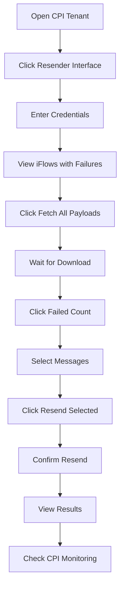

# SAP CPI Message Resender Extension

A Chrome extension for SAP Cloud Platform Integration that allows you to fetch, store, and resend failed integration messages.

## 🎯 Features

- ✅ **View iFlow Statistics** - See completed and failed message counts for all iFlows
- ✅ **Fetch Failed Messages** - Automatically retrieve failed messages from CPI logs
- ✅ **Download Payloads** - Extract and save message payloads from attachments
- ✅ **Local Storage** - Store payloads in browser for offline access
- ✅ **Bulk Selection** - Select multiple messages with checkboxes
- ✅ **Automatic Endpoint Discovery** - Fetch iFlow endpoints via API
- ✅ **Bulk Resend** - Resend multiple messages with one click
- ✅ **Cross-Origin Support** - Works across different SAP subdomains
- ✅ **NEO & Cloud Foundry** - Supports both platforms

## 📋 Requirements

- Chrome 88+ or Edge 88+
- SAP Cloud Platform Integration tenant (NEO or Cloud Foundry)
- User credentials with appropriate permissions:
  - Read access to MessageProcessingLogs
  - Read access to IntegrationRuntimeArtifacts
  - Execute access to iFlow endpoints

## 🚀 Quick Start

### Installation

1. Clone or download this repository
2. Open Chrome and navigate to `chrome://extensions/`
3. Enable "Developer mode" (toggle in top right)
4. Click "Load unpacked" and select the extension folder
5. The extension icon should appear in your toolbar

### Basic Usage

1. **Navigate to your SAP CPI tenant**
2. **Click the extension icon** or find "CPI Helper Lite" in the left navigation
3. **Click "Resender Interface"** and enter your credentials
4. **Click "Fetch All Payloads"** to download failed message payloads
5. **Click on a failed count** to view messages for that iFlow
6. **Select messages** using checkboxes
7. **Click "Resend Selected"** to resend the messages

## 📖 Documentation

- **[QUICK_START.md](QUICK_START.md)** - Step-by-step usage guide
- **[INTEGRATION_GUIDE.md](INTEGRATION_GUIDE.md)** - Technical integration details
- **[API_REFERENCE.md](#api-reference)** - Function reference (below)

## 🏗️ Architecture

### Files Structure

```
├── manifest.json                 # Extension configuration
├── background.js                 # Background service worker (CORS handling)
├── contentScript.js             # Main content script (existing)
├── resender_functions.js        # Core resender logic (NEW)
├── resender_ui.js               # UI components (NEW)
├── popup.html                   # Extension popup
├── popup.js                     # Popup logic
├── lib/
│   └── xmlToJson/              # XML parsing library
└── images/                      # Extension icons
```

### Data Flow

```
User Action
    ↓
UI Component (resender_ui.js)
    ↓
Core Function (resender_functions.js)
    ↓
HTTP Request (contentScript.js httpWithAuth)
    ↓
Background Script (background.js) [if cross-origin]
    ↓
SAP CPI API
    ↓
Response Processing
    ↓
Chrome Storage (chrome.storage.local)
    ↓
UI Update
```

## 🔧 API Reference

### Core Functions (resender_functions.js)

#### Fetch Attachments
```javascript
await fetchMessageAttachments(messageGuid, username, password)
// Returns: Array of attachment objects
```

#### Fetch Payload
```javascript
await fetchAttachmentPayload(attachmentId, username, password)
// Returns: Payload string (XML/JSON)
```

#### Save Payload
```javascript
await saveMessagePayload(iflowName, messageGuid, payload, metadata)
// Returns: Boolean (success)
```

#### Get Payload
```javascript
await getMessagePayload(iflowName, messageGuid)
// Returns: Stored payload object or null
```

#### Get All Payloads
```javascript
await getAllSavedPayloads()
// Returns: Object grouped by iFlow name
```

#### Fetch iFlow Endpoint
```javascript
await fetchIflowEndpoint(iflowName, username, password)
// Returns: { url, type, name }
```

#### Resend Message
```javascript
await resendMessage(endpoint, payload, username, password, contentType)
// Returns: { success, response } or { success, error }
```

#### Batch Fetch & Save
```javascript
await fetchAndSaveFailedMessagesWithPayloads(
  iflowName, 
  username, 
  password, 
  statusCallback
)
// Returns: { success, total, saved } or { success, error }
```

#### Batch Resend
```javascript
await resendSelectedMessages(
  selectedMessages, 
  iflowName, 
  username, 
  password, 
  statusCallback
)
// Returns: { success, results, successCount, totalCount }
```

### UI Functions (resender_ui.js)

#### Render Overview
```javascript
renderResenderOverview(iflowsWithFailures, credentials)
// Displays iFlows with failed message counts
```

#### Show Messages
```javascript
showResenderMessages(symbolicName, displayName, credentials)
// Displays failed messages for an iFlow with checkboxes
```

#### Update Counts
```javascript
await updateSavedCounts(iflows)
// Updates "Saved Payloads" column in UI
```

#### Fetch for iFlow
```javascript
await fetchPayloadsForIflow(iflow, credentials)
// Fetches and saves payloads for one iFlow
```

#### Fetch All
```javascript
await fetchAllPayloads(iflows, credentials)
// Fetches and saves payloads for all iFlows
```

## 🔐 Security

- **Credentials:** Stored encrypted by Chrome in `chrome.storage.local`
- **Payloads:** Stored unencrypted locally (consider adding encryption for sensitive data)
- **HTTPS Only:** All API calls use HTTPS
- **Domain Restricted:** Extension only works on SAP domains
- **No External Calls:** All data stays between browser and SAP CPI

## 🎨 UI Components

### Main Views

1. **Message Overview**
   - Table of all iFlows
   - Completed/Failed counts
   - "Get Message Overview" button
   - "Resender Interface" button

2. **Resender Overview**
   - iFlows with failed messages
   - Failed count (clickable)
   - Saved payload count
   - "Fetch Payloads" button per iFlow
   - "Fetch All Payloads" button

3. **Message List**
   - Failed messages for selected iFlow
   - Checkboxes for selection
   - Message details (ID, status, timestamp, error)
   - "Select All" button
   - "Resend Selected (X)" button

### Styling

The extension uses inline styles with these CSS classes:
- `.cpi-lite-panel` - Main panel container
- `.cpi-lite-table` - Data tables
- `.cpi-lite-btn` - Action buttons
- `.cpi-lite-checkbox` - Checkboxes
- `.cpi-lite-link` - Clickable links
- `.cpi-lite-dark` - Dark theme support

## 🧪 Testing

### Manual Testing Checklist

- [ ] Extension loads without errors
- [ ] "Get Message Overview" shows iFlows
- [ ] "Resender Interface" prompts for credentials
- [ ] Credentials are saved and reused
- [ ] "Fetch All Payloads" downloads payloads
- [ ] "Saved Payloads" count updates correctly
- [ ] Clicking failed count shows message list
- [ ] Checkboxes work correctly
- [ ] "Select All" toggles all checkboxes
- [ ] "Resend Selected" button enables/disables correctly
- [ ] Resend operation completes successfully
- [ ] Messages appear in CPI monitoring
- [ ] Error handling works (wrong credentials, network errors, etc.)

### Test Scenarios

1. **Happy Path:**
   - Fetch payloads → Select messages → Resend → Verify in CPI

2. **No Payloads:**
   - Try to resend without fetching → Should show error

3. **Authentication:**
   - Wrong credentials → Should show auth error
   - Correct credentials → Should work

4. **Network:**
   - Disconnect network → Should show network error
   - Reconnect → Should work

5. **Edge Cases:**
   - iFlow with no failed messages
   - iFlow with no HTTP endpoints
   - Message with no attachments
   - Large payload (>1MB)

## 🐛 Troubleshooting

### Common Issues

| Issue | Cause | Solution |
|-------|-------|----------|
| "Payload not found" | Payloads not fetched | Click "Fetch Payloads" first |
| "No endpoint found" | iFlow has no HTTP adapter | Check iFlow configuration |
| "Authentication failed" | Wrong credentials | Re-enter credentials |
| "Extension context invalidated" | Extension reloaded | Refresh CPI page |
| Checkboxes disabled | No saved payloads | Fetch payloads first |
| CORS errors | Cross-origin blocked | Should auto-handle via background script |

### Debug Mode

Enable debug logging in browser console:
```javascript
// In contentScript.js, all console.log statements are already present
// Open DevTools (F12) → Console tab to see logs
```

## 📊 Performance

- **Fetch time:** ~1-2 seconds per message
- **Storage:** ~10-50KB per payload (varies by message size)
- **Resend time:** ~1-2 seconds per message
- **Concurrent requests:** 6 at a time (configurable)
- **Storage limit:** 10MB total (can be increased with `unlimitedStorage` permission)

## 🔄 Workflow Example



## 🚧 Limitations

1. **Attachment Selection:** Only fetches first attachment (usually the logged payload)
2. **Content Type:** Optimized for XML (works with JSON too)
3. **Endpoint Selection:** Uses first HTTP entry point
4. **Storage Limit:** 10MB total (can be increased)
5. **No Scheduling:** Manual resend only
6. **No Transformation:** Resends original payload as-is
7. **No Payload Preview:** Can't view payload before resending (planned feature)
8. **No History:** Doesn't track resend history (planned feature)

## 🗺️ Roadmap

### Planned Features

- [ ] Payload preview/editor before resending
- [ ] Support for JSON and other content types
- [ ] Bulk delete old payloads
- [ ] Export/import payloads
- [ ] Resend history tracking
- [ ] Scheduled resend
- [ ] Payload transformation (XSLT, JSONata)
- [ ] Multi-tenant support
- [ ] Payload encryption
- [ ] Advanced filtering
- [ ] Statistics dashboard
- [ ] Email notifications

## 🤝 Contributing

Contributions are welcome! Please:

1. Fork the repository
2. Create a feature branch
3. Make your changes
4. Test thoroughly
5. Submit a pull request

## 📄 License

Same as the original CPI Helper Lite extension.

## 🙏 Acknowledgments

- Built on top of CPI Helper Lite
- Uses xmlToJson library for XML parsing
- Inspired by SAP CPI community needs

## 📞 Support

For issues or questions:
1. Check [QUICK_START.md](QUICK_START.md) for usage help
2. Check [INTEGRATION_GUIDE.md](INTEGRATION_GUIDE.md) for technical details
3. Review browser console for error messages
4. Verify API permissions in SAP CPI
5. Test API calls manually using Postman/curl

## 🔗 Related Resources

- [SAP CPI Documentation](https://help.sap.com/docs/CLOUD_INTEGRATION)
- [SAP CPI OData API](https://api.sap.com/api/MessageProcessingLogs)
- [Chrome Extension Documentation](https://developer.chrome.com/docs/extensions/)

---

**Made with ❤️ for the SAP CPI community**
